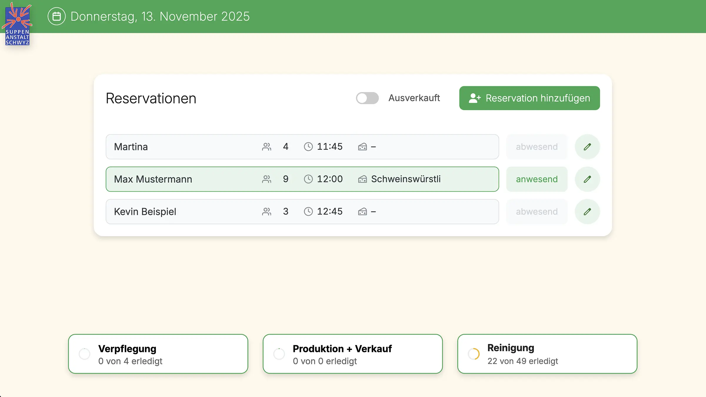
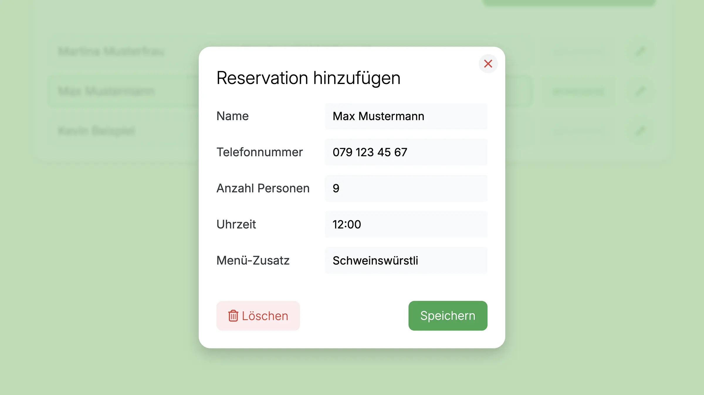
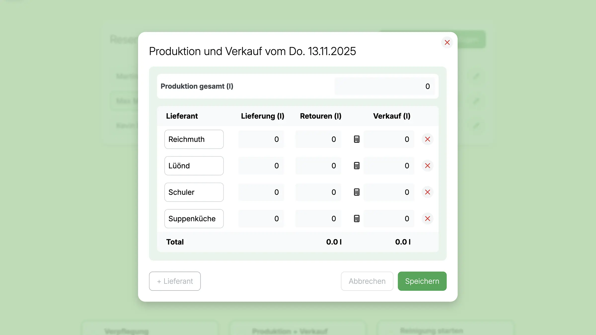
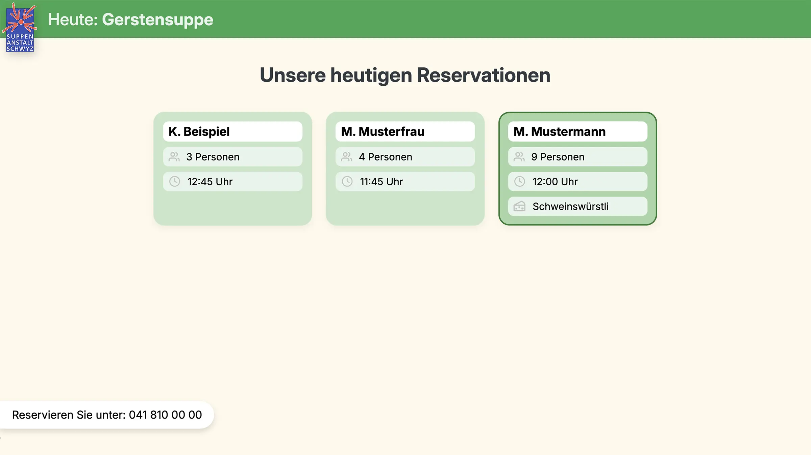

# UD Reservation

Frontend-Reservierungssystem mit Tagesmenü-Integration („Suppentag“), Echtzeit-Synchronisation und optionalem Kiosk-Modus.
Entwickelt für gastronomische Einrichtungen wie die Suppenanstalt Schwyz – vollständig Gutenberg- und REST-basiert.

---

## Funktionen

- **Gutenberg-Block „UD Reservation“**
  Erzeugt ein modernes Frontend-Formular für Tisch- oder Menü-Reservationen mit Live-Validierung und REST-Anbindung.

- **Echtzeit-Kommunikation (Ably)**
  Reservationen, Auslastung und Tagesmenüs werden ohne Seiten-Reload aktualisiert.

- **Suppentag-Verwaltung**
  Backend-Metabox für Menübild und Beschreibung, REST-Endpunkte für den aktuellen Tag, Media-Uploader inklusive.

- **Kiosk-Modus**
  Vollbildanzeige mit automatischer Rotation zwischen Menü-Bild und Reservationen.

- **Produktions- und Verpflegungs-Ansicht**
  Spezielle Bildschirme für Küche, Verkauf und Ausgabe mit Live-Status-Updates.

- **Admin-Tools**
  - Übersicht aller Reservationen
  - Schnellbearbeitung ohne Einzel-Edit
  - Ajax-basierter Sold-Out-Schalter
  - Zusätzliche Spalten (Datum, Personen, Status)

- **REST-API**
  - `/ud-reservation/v1/reservation` – Anlegen & Abrufen von Reservationen
  - `/ud-reservation/v1/soldout` – Ausverkauft-Status
  - `/ud-reservation/v1/soup` – Tagesmenü

- **Technische Highlights**
  - Flatpickr mit deutscher Lokalisierung
  - Toast-Benachrichtigungen ohne Inline-Styles
  - `@wordpress/scripts`-Build (Webpack 5, SCSS → CSS, ESNext)
  - Komponenten mit `__next40pxDefaultSize` & `__nextHasNoMarginBottom`
  - FSE-kompatibel mit Theme `ulrichdigital_block_theme`

---

## Screenshots

*Eine Mitarbeiterin an der Rezeption verwaltet digitale Reservationen direkt am Tablet. Die Anzeige im Hintergrund zeigt den aktuellen Buchungsstatus in Echtzeit.*

*Übersicht über alle Reservationen im Frontend.*

*Reservationen im Frontend hinzufügen und bearbeiten.*

*Erfassung von Produktion, Lieferung und Verkauf.*

*Automatische Anzeige der aktuellen Reservationen und Tagesmenüs in Echtzeit.*

---

## Installation

1. Repository in den Plugin-Ordner von WordPress kopieren:
   `/wp-content/plugins/ud-reservation/`
2. Plugin im WordPress-Backend aktivieren.
3. Gutenberg-Block **„UD Reservation“** im Seiten- oder Beitragseditor hinzufügen.
4. Suppentags-Informationen im Backend hinterlegen (Bild, Beschreibung, Status).
5. Optional: Kiosk- oder Produktions-Ansicht über eigene Seiten/Shortcodes einbinden.

---

## Anforderungen

- WordPress 6.7 oder neuer
- PHP 8.0+
- Aktives Theme: `ulrichdigital_block_theme`
- Ably-API-Key für Echtzeit-Übertragung

---

## Autor

[ulrich.digital gmbh](https://ulrich.digital)

---

## Lizenz

Alle Rechte vorbehalten. Dieses Plugin ist urheberrechtlich geschützt und darf ohne ausdrückliche schriftliche Genehmigung der **ulrich.digital gmbh** weder kopiert, verbreitet, verändert noch weiterverwendet werden.
